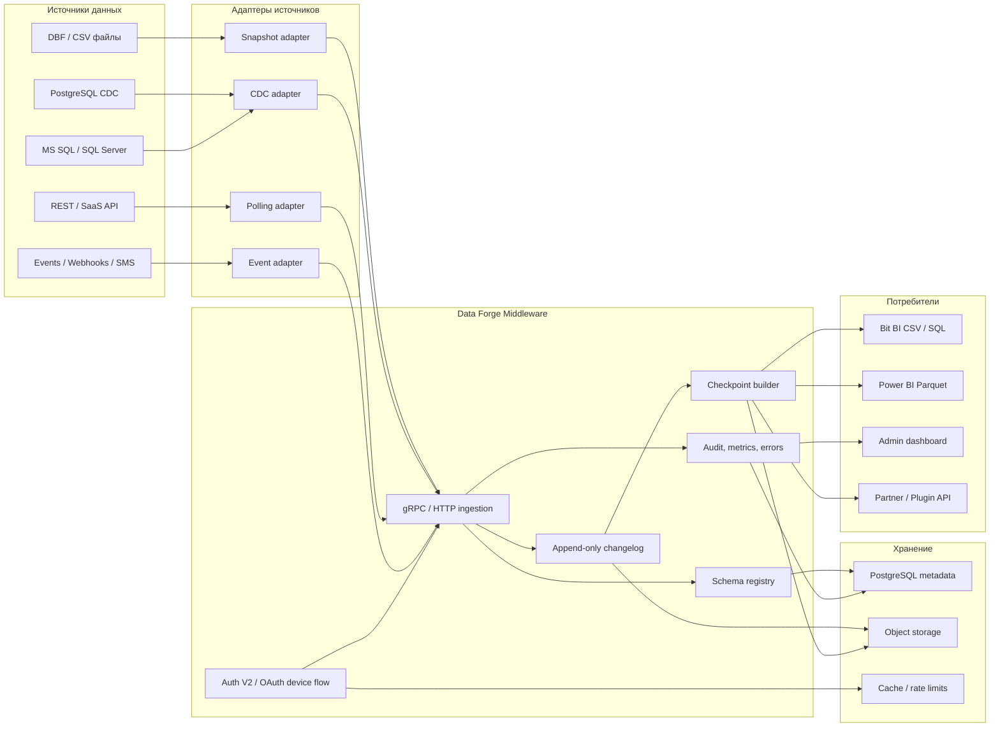
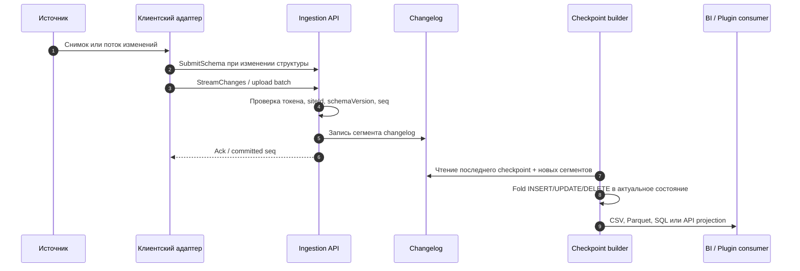
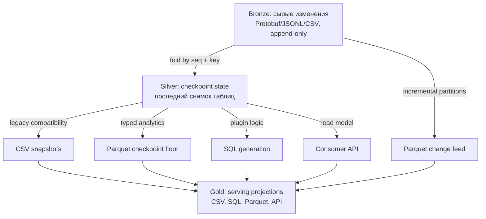
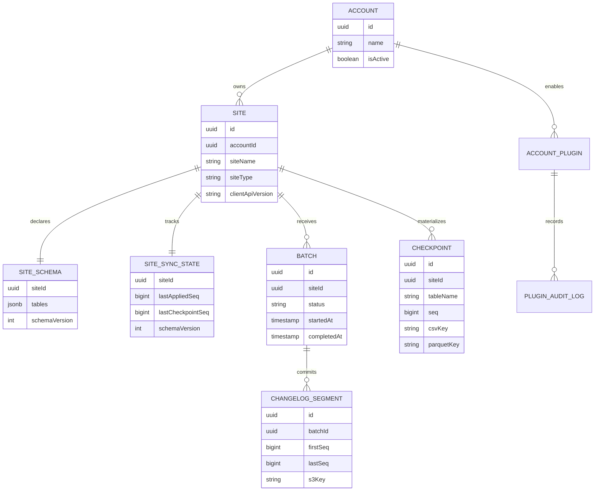
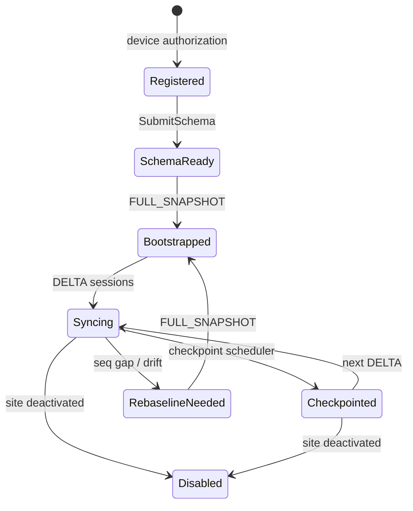
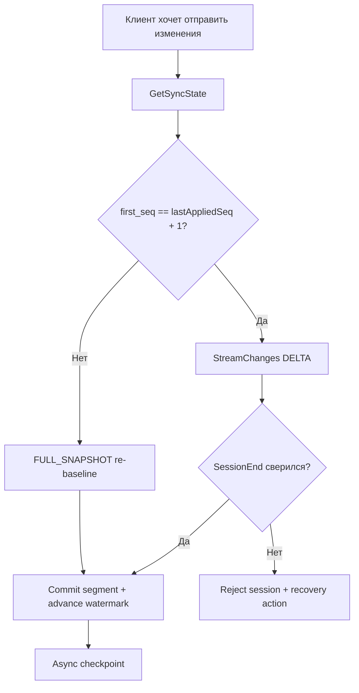
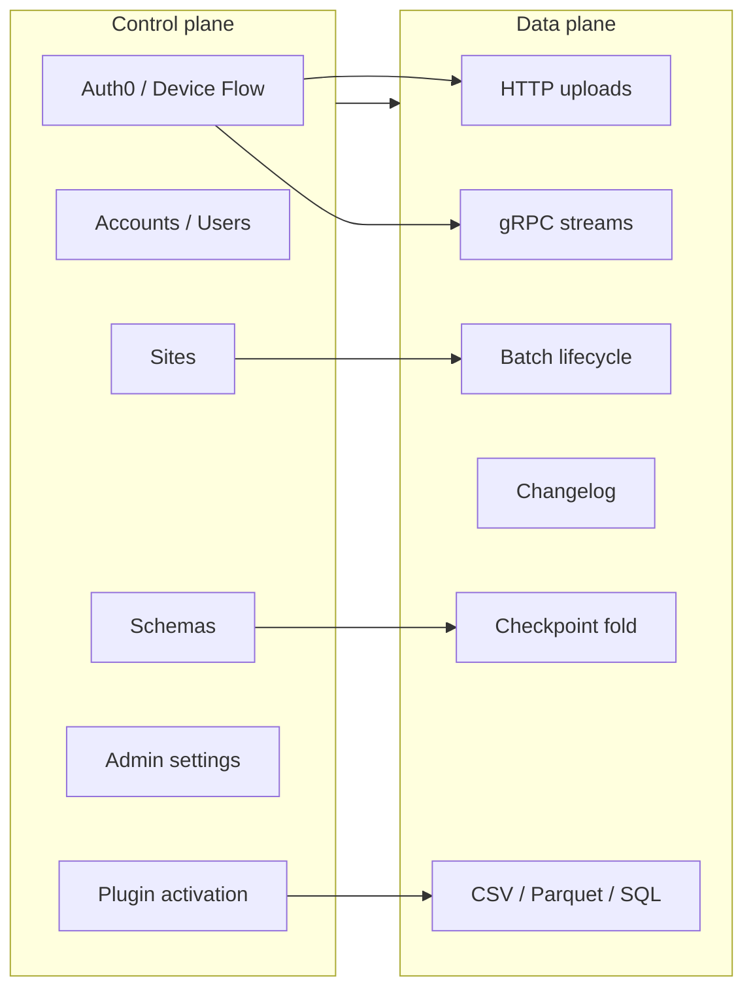
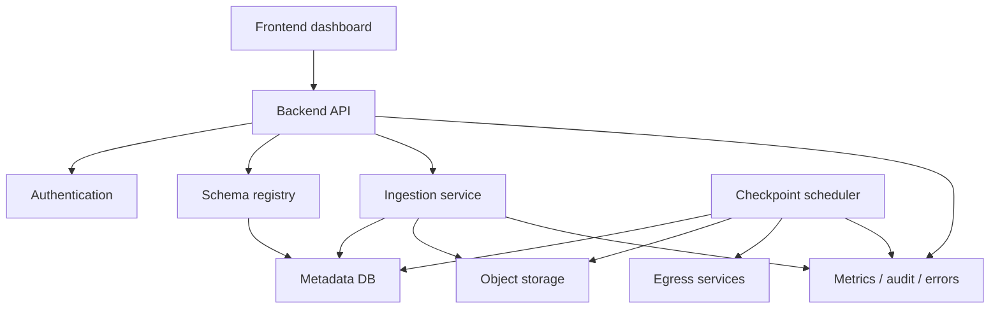
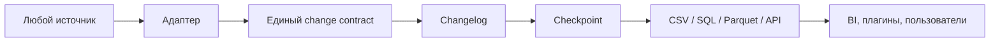

# Концепция платформы сбора данных

- **Версия документа**: 1.0.0
- **Обновлено**: 2026-06-22
- **Аудитория**: продуктовая команда, архитекторы, backend/frontend-разработчики, интеграторы источников данных
- **Связанные документы**: [Delta Client v2](./delta-client-v2-guide.md), [Postgres CDC Client](./postgres-cdc-client-guide.md), [Bit BI Integration](./bitbi-integration.md)

## 1. Идея проекта

Проект можно описать как **middleware-платформу для безопасного сбора, нормализации и доставки данных из разных источников в аналитические продукты**.

Главная идея: источник данных не обязан знать, как устроены BI-системы, хранилища, SQL-генераторы или пользовательские дашборды. Он должен уметь только зарегистрироваться, описать свою схему и передать изменения. Платформа принимает эти изменения, хранит их в устойчивом формате, восстанавливает текущее состояние и отдаёт данные разным потребителям в удобном для них виде.

В существующей форме проект уже выражает эту идею через несколько путей:

| Направление | Что делает |
|---|---|
| DBF/CSV upload | Принимает полные файловые снимки от legacy-клиентов |
| Postgres CDC v1 | Принимает схему и JSONL-дельты через HTTP |
| Delta Client v2 | Принимает типизированные дельты через gRPC/Protobuf |
| Changelog + checkpoint | Хранит историю изменений и материализует актуальные снимки |
| CSV egress | Даёт Bit BI привычные CSV-файлы |
| Parquet egress | Даёт Power BI и похожим системам типизированный инкрементальный слой |
| Plugin API | Позволяет внешним продуктам подключаться к данным аккаунта |

Если описывать проект одной фразой:

> Это слой между источниками данных и аналитикой: он превращает разрозненные uploads, CDC-потоки и batch-выгрузки в управляемый changelog, checkpoint’ы и форматы выдачи вроде CSV, SQL и Parquet.

## 2. Какая проблема решается

У компаний обычно нет одного идеального источника данных. Реальная картина выглядит смешанно:

- PostgreSQL с логической репликацией.
- MS SQL или другие SQL-базы.
- DBF/CSV-файлы из старых систем.
- REST/SaaS API, CRM, ERP, биллинг.
- Очереди событий, webhooks, сообщения, SMS/notification-сервисы.
- Ручные выгрузки и файлы из операционных систем.

Без middleware каждый потребитель данных начинает писать собственные интеграции: одна команда парсит CSV, другая читает SQL, третья строит коннектор к Power BI, четвёртая вручную решает проблему повторной загрузки и пропущенных изменений. Это быстро превращается в набор несовместимых пайплайнов.

Платформа решает это иначе:

1. Каждый источник подключается через адаптер.
2. Адаптер переводит данные в общий контракт изменений.
3. Сервер хранит изменения как append-only changelog.
4. Checkpoint-процесс собирает из changelog актуальный снимок.
5. Потребители читают данные в своём формате: CSV, SQL, Parquet, API.

## 3. Общая инфографика



## 4. Архитектурный принцип: один контракт, много источников

Ключевой проектный ход — не делать отдельную бизнес-логику под каждый источник. Разные источники отличаются способом чтения данных, но после адаптера они должны выглядеть одинаково.

Общий внутренний контракт:

| Поле | Смысл |
|---|---|
| `siteId` | Какой клиентский сайт/источник отправляет данные |
| `table` | Логическая таблица или коллекция |
| `op` | `INSERT`, `UPDATE`, `DELETE` |
| `seq` | Монотонный номер изменения для восстановления порядка |
| `key` | Первичный ключ или идентификатор записи |
| `data` | Значения колонок или changed fields |
| `sourceTs` | Время изменения на стороне источника |
| `schemaVersion` | Версия схемы, по которой сформированы данные |

В Delta Client v2 этот контракт выражен как Protobuf `ChangeRecord` и передаётся через gRPC stream. Для HTTP/JSONL или файловых адаптеров идея та же: входной формат может быть другим, но внутри сервера он приводится к одному типу изменения.

## 5. Поток данных: от источника до аналитики



Этот поток отделяет ingest от выдачи. Источники не ждут, пока Power BI или Bit BI прочитают данные. Они только доставляют изменения и получают подтверждённый watermark. Выдача форматов происходит асинхронно.

## 6. Слои данных



### Bronze: changelog

Bronze-слой хранит изменения как неизменяемые сегменты. Это источник правды. В текущей Delta v2-идее сегмент — это набор Protobuf-записей, сжатый и положенный в object storage.

Пример назначения:

- восстановить состояние после сбоя;
- повторно построить checkpoint;
- доказать, какие изменения были приняты;
- поддержать re-baseline при дрейфе или пропущенных seq.

### Silver: checkpoint

Checkpoint — материализованный снимок таблиц на определённом `seq`. Он строится так:

```text
latest checkpoint + changelog segments after checkpoint = current state
```

Это ограничивает стоимость восстановления. Серверу не нужно каждый раз сворачивать всю историю с первого дня.

### Gold: serving projections

Gold-слой — это форматы для потребителей:

- CSV для обратной совместимости с Bit BI.
- Parquet checkpoint floor и Parquet change feed для Power BI.
- SQL-файлы или SQL-дельты для интеграций, которым нужен исполняемый SQL.
- REST/Plugin API для партнёрских приложений.

## 7. Почему gRPC и Protobuf

gRPC не нужен просто “ради скорости”. Его ценность здесь в контракте и жизненном цикле сессии.

| Возможность | Зачем нужна |
|---|---|
| Protobuf schema | Типизированный контракт, codegen для клиентов, меньше договорённостей “на словах” |
| Bidirectional streaming | Клиент шлёт изменения, сервер параллельно отдаёт ack и recovery-сигналы |
| HTTP/2 flow control | Естественная основа для backpressure |
| Unary RPC | Удобные команды вроде `GetSyncState` и `SubmitSchema` |
| Metadata auth | Bearer-токен в gRPC metadata, совместимый с Auth V2 |

При этом HTTP остаётся полезным:

- для legacy uploads;
- для админских и пользовательских REST API;
- для plugin-интеграций;
- для простых источников, которым stream пока не нужен.

Правильная архитектура не противопоставляет HTTP и gRPC. Она использует HTTP для control plane и совместимости, а gRPC — для надёжного data plane.

## 8. Почему Parquet

Parquet — это не транспортный формат ingest, а формат выдачи и аналитического хранения.

Он подходит для BI, потому что:

- хранит колонки типизированно;
- эффективно сжимает повторяющиеся значения;
- хорошо читается аналитическими движками;
- поддерживает partition layout, например `_change_date=YYYY-MM-DD`;
- не заставляет потребителя парсить CSV и угадывать типы.

В этой модели:

```text
gRPC / Protobuf = как данные попадают в систему
Changelog       = что система считает источником правды
Checkpoint      = как система материализует состояние
Parquet         = как аналитика эффективно читает результат
```

## 9. Варианты источников и адаптеров

| Источник | Как читать | Что отправлять в middleware |
|---|---|---|
| PostgreSQL | Logical replication / WAL / Debezium-like reader | `INSERT/UPDATE/DELETE` с `seq`, PK и typed values |
| MS SQL | CDC tables, Change Tracking, transaction log connector | Такой же поток изменений |
| MySQL | Binlog connector | Такой же поток изменений |
| DBF/CSV | Периодический snapshot и diff на клиенте или сервере | Полный snapshot или вычисленные дельты |
| REST/SaaS API | Polling по `updated_at`, cursor или webhook | Upsert/delete события |
| ERP/CRM | Экспорт файлов или API | Нормализованные таблицы |
| SMS/events | Event stream или webhook | Append-only события, часто без update/delete |

Адаптер отвечает только за чтение своего источника и перевод в общий change contract. Сервер отвечает за безопасность, порядок, хранение, checkpoint, выдачу и аудит.

## 10. Доменная модель продукта



Главные агрегаты:

- **Account** — tenant и владелец данных.
- **Site** — конкретный источник или клиентская инсталляция.
- **SiteSchema** — описание таблиц, колонок, типов и ключей.
- **Batch/Session** — единица приёма данных.
- **ChangelogSegment** — immutable-сегмент принятых изменений.
- **Checkpoint** — актуальный материализованный снимок.
- **Plugin** — способ подключить потребителя данных.

## 11. Жизненный цикл сайта



Типичный сценарий:

1. Клиент регистрирует site через Device Authorization Flow.
2. Пользователь подтверждает привязку site к account.
3. Клиент получает access/refresh token.
4. Клиент отправляет схему таблиц.
5. Клиент отправляет первый полный снимок как `FULL_SNAPSHOT`.
6. Далее клиент отправляет только дельты.
7. Сервер строит checkpoint и форматы выдачи.
8. При разрыве порядка или потере состояния клиент делает re-baseline полным снимком.

## 12. Надёжность: seq, watermark, ack, re-baseline

Важная часть идеи — система должна понимать, где она находится в потоке изменений.

| Механизм | Что даёт |
|---|---|
| `seq` | Глобальный для site порядок изменений |
| `lastAppliedSeq` | Durable watermark на сервере |
| `GetSyncState` | Клиент после рестарта узнаёт, с какого места продолжать |
| `Ack` | Клиент видит прогресс внутри stream-сессии |
| `SessionEnd` counts/hash | Сервер сверяет, что принял ровно то, что клиент отправил |
| `NEED_REBASELINE` | При дрейфе сервер просит полный снимок вместо рискованного продолжения |



## 13. Control plane и data plane

Удобно мыслить проект как два слоя.



Control plane отвечает за то, **кто имеет право и как источник описан**. Data plane отвечает за то, **как данные движутся, хранятся и выдаются**.

## 14. Безопасность и multi-tenant модель

Платформа должна быть multi-tenant by design:

- каждый source/site принадлежит account;
- токен клиента привязан к конкретному site;
- site не выбирает произвольный `siteId` в запросе, сервер выводит его из токена;
- admin API и client API разделены;
- plugin API имеет отдельную auth-модель, например API key;
- audit logs фиксируют активации, выгрузки, ошибки и важные действия;
- sensitive data не должна попадать в audit-метаданные.

В текущем проекте эта идея выражена через:

- Auth0 OAuth2 для admin/user API;
- OAuth 2.0 Device Authorization Flow для клиентов;
- Bearer token в gRPC metadata для Delta v2;
- API key для Bit BI plugin API;
- partitioned audit/error logs;
- rate limiting для plugin endpoints.

## 15. Что получает потребитель

Один и тот же поток изменений может обслужить разные продукты:

| Потребитель | Что ему нужно | Что отдаёт платформа |
|---|---|---|
| Bit BI | CSV/SQL-совместимость | Реконструированный CSV checkpoint, SQL generation |
| Power BI | Инкрементальная аналитика | Parquet checkpoint floor + partitioned change feed |
| Admin dashboard | Статусы, ошибки, история | REST API, unread errors, batch/plugin logs |
| Partner integration | Контролируемый доступ к данным account | Plugin API с auth, фильтрами и аудитом |
| Data ops | Диагностика и восстановление | Watermarks, segment metadata, re-baseline flow |

## 16. Как проектировать похожий продукт с нуля

Это не список оставшихся задач текущего проекта, а минимальная архитектурная логика для похожего продукта.

### Шаг 1. Сформулировать общий change contract

Сначала нужно решить, какой объект изменения является универсальным для всех источников. Обычно достаточно:

```text
source/site + table/collection + operation + sequence + key + data + schema version + source timestamp
```

Если этот контракт не продуман, каждый новый источник будет ломать архитектуру.

### Шаг 2. Разделить source adapters и core ingestion

Адаптеры должны быть заменяемыми. PostgreSQL, MS SQL, REST API и CSV отличаются только способом извлечения изменений. Core ingestion не должен знать детали WAL, binlog, DBF или webhook-подписей.

### Шаг 3. Выбрать транспорт

Практичная комбинация:

- gRPC/Protobuf для потоковых дельт и надёжного resume;
- HTTP REST для control plane, admin UI, plugins и legacy upload;
- object storage для больших файлов и материализованных артефактов.

### Шаг 4. Сразу заложить changelog как источник правды

Не стоит начинать с “просто перезапишем текущую таблицу”. Для интеграционной платформы важна история принятых изменений. Append-only changelog проще отлаживать, переигрывать и проверять.

### Шаг 5. Добавить checkpoint, чтобы история не стала бесконечной нагрузкой

Чистый changelog удобен, но со временем дорого сворачивается. Checkpoint ограничивает стоимость восстановления и становится базой для CSV/Parquet выдачи.

### Шаг 6. Делать egress отдельно от ingest

Ingest должен быстро и надёжно принять изменения. Выдача в CSV, Parquet или SQL может происходить асинхронно. Это снижает связанность и позволяет добавлять новые форматы без изменения клиентского протокола.

### Шаг 7. Считать schema registry частью ядра

Без схемы невозможно корректно:

- типизировать Parquet;
- понять primary key;
- отличить update от delete+insert;
- валидировать данные;
- объяснить пользователю, почему batch отклонён.

### Шаг 8. Проектировать recovery как продуктовую функцию

Потери сети, рестарты клиента, частичные uploads и schema drift будут происходить всегда. Поэтому в архитектуре нужны:

- durable watermark;
- idempotency/session id;
- seq gap detection;
- explicit recovery actions;
- re-baseline через полный snapshot.

## 17. Минимальный набор компонентов



Минимальный MVP похожего проекта:

| Компонент | Минимальная ответственность |
|---|---|
| Auth | Разделить admin/user/client/plugin доступ |
| Site registry | Создавать источники и связывать их с account |
| Schema registry | Хранить таблицы, колонки, типы, ключи |
| Ingestion API | Принимать snapshot/delta, проверять порядок |
| Changelog storage | Хранить immutable segments |
| Checkpoint builder | Сворачивать changes в current state |
| Egress | Отдавать CSV/Parquet/API |
| Observability | Ошибки, audit, метрики, статусы |

## 18. Что важно не усложнить

Не обязательно сразу строить lakehouse на Iceberg/Delta/Hudi, если задача — принять данные, восстановить снимки и кормить BI. Для текущего масштаба проще и понятнее:

- metadata в PostgreSQL;
- большие артефакты в S3-compatible object storage;
- changelog + checkpoints вместо mutable customer database;
- Parquet как формат выдачи, а не как первичный протокол записи;
- plugins как расширение egress, а не как отдельные ingestion-пайплайны.

Это оставляет возможность вырасти в lakehouse позже, но не заставляет платить архитектурную цену в самом начале.

## 19. Короткая формула проекта



**Суть проекта**: собрать данные из любых систем, привести их к единой модели изменений, сохранить надёжную историю, материализовать актуальное состояние и отдать его разным потребителям без переписывания интеграций под каждого потребителя.
